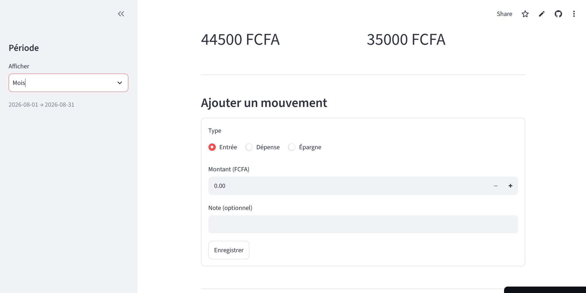

# 💰 Gestion de Dépenses


🔗 **[Voir l'application en ligne](https://gestion-depenses-js4kzm5nnanptpht5jadba.streamlit.app)** *(version démo avec données fictives)*

Application de suivi de dépenses personnelles, conçue pour un revenu irrégulier : suivre en temps réel le solde disponible entre entrées d'argent et dépenses, tout en constituant une épargne protégée du solde courant.

Projet développé de zéro dans le cadre d'une remise à niveau en programmation Python, après une interruption professionnelle de 3 ans.



## Pourquoi ce projet

Les applications de budget classiques supposent un revenu fixe mensuel et des enveloppes prévisionnelles par catégorie. Avec une activité indépendante, ce modèle ne correspond pas à un usage réel : l'argent arrive de façon irrégulière, et la gestion se fait réactivement, entrée par entrée. Cette application a été conçue pour ce cas d'usage précis, avec un objectif central : suivre les dépenses **en vue d'épargner efficacement**.

## Fonctionnalités

- Enregistrement des entrées d'argent, dépenses et épargnes
- Catégorisation libre des dépenses (aucune liste imposée)
- Calcul du solde disponible = entrées − dépenses − épargne, sur une période choisie (jour / semaine / mois / année)
- Suivi de l'épargne totale accumulée, exclue du solde dépensable
- Répartition visuelle des dépenses par catégorie
- Modification et suppression des mouvements enregistrés
- Deux interfaces : ligne de commande et application web (Streamlit)

## Stack technique

| Domaine | Choix | Justification |
|---|---|---|
| Langage | Python 3.12 | Version stable, écosystème mature |
| Base de données | SQLite | Application locale mono-utilisateur, zéro configuration |
| Interface web | Streamlit | Prototypage rapide, adapté à un projet solo |
| Tests | pytest | Standard de l'écosystème Python |
| Qualité de code | Ruff | Linting + formatage en un seul outil |
| CI/CD | GitHub Actions | Tests et vérification de style à chaque push |
| Déploiement | Streamlit Community Cloud | Gratuit, intégré à GitHub |

## Architecture

Le projet suit une architecture en couches strictes, chaque couche ne dépendant que de celle immédiatement en dessous :

```
Interface (CLI ou Streamlit)
        ↓
Services (calculs métier : solde, épargne, répartition)
        ↓
Repository (accès à la base de données)
        ↓
SQLite
```

Ce découplage a été vérifié concrètement : l'interface Streamlit a été ajoutée sans modifier une seule ligne des couches `models/`, `repositories/` ou `services/`.

```
gestion-depenses/
├── .github/workflows/     # Intégration continue
├── docs/                  # Cahier des charges, UML, journal de bord
├── src/
│   ├── models/             # Entités métier (Mouvement)
│   ├── repositories/       # Accès SQLite
│   ├── services/           # Calculs (solde, périodes)
│   └── database/           # Schéma et connexion
├── tests/                  # 16 tests automatisés
├── main.py                 # Interface ligne de commande
├── app.py                  # Interface web Streamlit
└── requirements.txt
```

## Installation locale

```bash
git clone https://github.com/sylvain-kadio/gestion-depenses.git
cd gestion-depenses
python -m venv .venv
.venv\Scripts\activate          # Windows
pip install -r requirements.txt
```

**Interface en ligne de commande :**
```bash
python main.py
```

**Interface web :**
```bash
streamlit run app.py
```

## Tests

```bash
pytest -v
```

16 tests couvrant le modèle, le repository et les services de calcul.

## Démarche de développement

Projet mené en autonomie, avec une assistance IA utilisée pour l'explication de concepts, la génération de squelettes de tests et le débogage — jamais pour produire du code non compris. Chaque fonctionnalité a été testée manuellement avant d'être validée par des tests automatisés.

Le détail de la progression, des décisions techniques et des difficultés rencontrées est disponible dans [`docs/journal.md`](docs/journal.md).

## Auteur

Sylvain Kadio — [GitHub](https://github.com/sylvain-kadio)