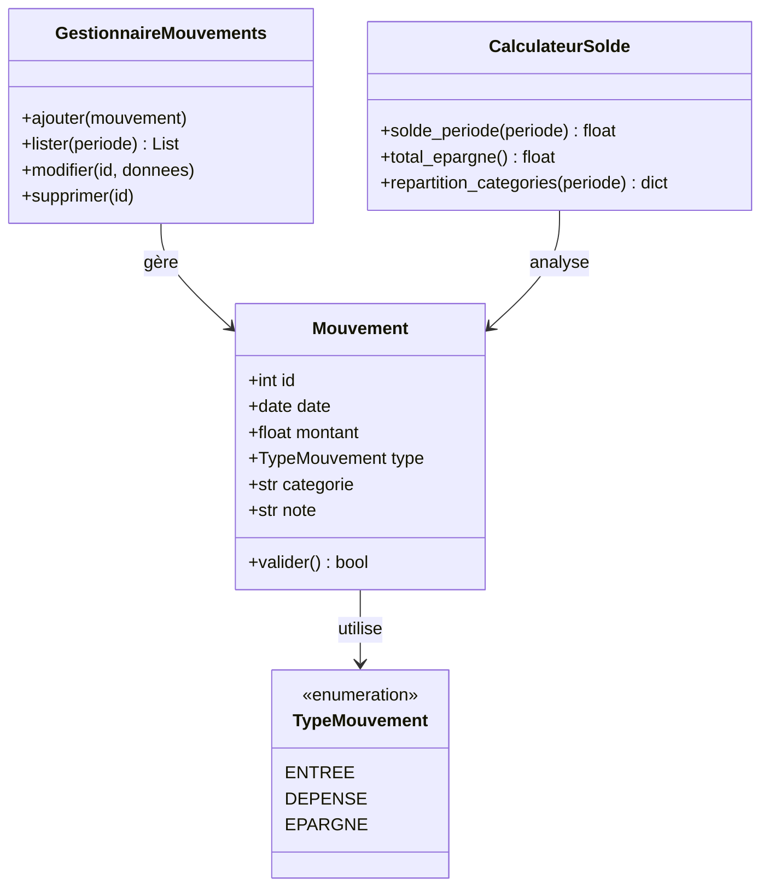

# Diagramme de classes

```mermaid
classDiagram
class TypeMouvement {
  <<enumeration>>
  ENTREE
  DEPENSE
  EPARGNE
}
class Mouvement {
  +int id
  +date date
  +float montant
  +TypeMouvement type
  +str categorie
  +str note
  +valider() bool
}
class GestionnaireMouvements {
  +ajouter(mouvement)
  +lister(periode) List
  +modifier(id, donnees)
  +supprimer(id)
}
class CalculateurSolde {
  +solde_periode(periode) float
  +total_epargne() float
  +repartition_categories(periode) dict
}
GestionnaireMouvements --> Mouvement : gère
CalculateurSolde --> Mouvement : analyse
Mouvement --> TypeMouvement : utilise
```